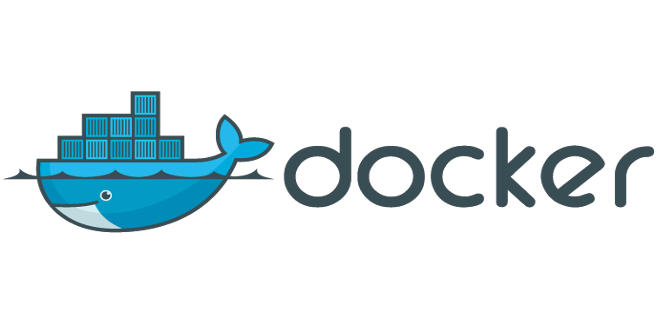

## **Docker介绍** 

> [参考链接](https://www.zhihu.com/question/28300645)

Docker的思想来自于集装箱，集装箱解决了什么问题？在一艘大船上，可以把货物规整的摆放起来。并且各种各样的货物被集装箱标准化了，集装箱和集装箱之间不会互相影响。那么我就不需要专门运送水果的船和专门运送化学品的船了。只要这些货物在集装箱里封装的好好的，那我就可以用一艘大船把他们都运走。

docker就是类似的理念。现在都流行云计算了，云计算就好比大货轮。docker就是集装箱。

1. 不同的应用程序可能会有不同的应用环境，比如.net开发的网站和php开发的网站依赖的软件就不一样，如果把他们依赖的软件都安装在一个服务器上就要调试很久，而且很麻烦，还会造成一些冲突。比如IIS和Apache访问端口冲突。这个时候你就要隔离.net开发的网站和php开发的网站。常规来讲，我们可以在服务器上创建不同的虚拟机在不同的虚拟机上放置不同的应用，但是虚拟机开销比较高。docker可以实现虚拟机隔离应用环境的功能，并且开销比虚拟机小，小就意味着省钱了。
2. 你开发软件的时候用的是Ubuntu，但是运维管理的都是centos，运维在把你的软件从开发环境转移到生产环境的时候就会遇到一些Ubuntu转centos的问题，比如：有个特殊版本的数据库，只有Ubuntu支持，centos不支持，在转移的过程当中运维就得想办法解决这样的问题。这时候要是有docker你就可以把开发环境直接封装转移给运维，运维直接部署你给他的docker就可以了。而且部署速度快。
3. 在服务器负载方面，如果你单独开一个虚拟机，那么虚拟机会占用空闲内存的，docker部署的话，这些内存就会利用起来。

总之docker就是**集装箱原理**。


## Docker-CE安装

> [参考文档：官方Docs](https://docs.docker.com/install/linux/docker-ce/ubuntu/)

#### Prerequisites

Docker目前分为两个版本：

- Docker Enterprise Edition (Docker EE) 专为企业开发和IT团队设计，用于在大规模生产中构建，运送和运行关键业务应用程序。Docker EE集成，认证和支持，为企业提供业界最安全的容器平台，使所有应用程序现代化。 `收费`
- Docker Community Edition (Docker CE) 是开发人员和小团队的理想选择，希望开始使用Docker并尝试基于容器的应用程序。Docker CE可在许多平台上使用，从桌面到云到服务器。 `免费`

我们团队使用的是  `Docker Community Edition (Docker CE)`

**OS requirements**

Ubuntu系统必须是64位的，并且：

- Artful 17.10 (Docker CE 17.11 Edge and higher only)
- Xenial 16.04 (LTS)
- Trusty 14.04 (LTS)

**卸载旧版本**

```bash
$ sudo apt-get remove docker docker-engine docker.io
```

**AUFS**

`Ubuntu14.04 强烈建议安装` Docker 的AUFS存储驱动程序：

```bash
$ sudo apt-get update

$ sudo apt-get install \
    linux-image-extra-$(uname -r) \
    linux-image-extra-virtual
```

#### Install Docker CE

##### Install using the repository

**SET UP THE REPOSITORY**

1. Update

   ```bash
   $ sudo apt-get update
   ```

2. 安装docker包

   ```bash
   $ sudo apt-get install \
       apt-transport-https \
       ca-certificates \
       curl \
       software-properties-common
   ```

3. 添加Docker的官方GPG密钥

   ```bash
   $ curl -fsSL https://download.docker.com/linux/ubuntu/gpg | sudo apt-key add -
   ```

   如果出现错误：

   ```bash
   $ curl -fsSL https://download.docker.com/linux/ubuntu/gpg | sudo apt-key add -
   curl: (7) Failed to connect to 127.0.0.1 port 41662: Connection refused
   gpg: no valid OpenPGP data found.
   ```

   尝试命令前加上sudo：

   ```bash
   $ sudo curl -fsSL https://download.docker.com/linux/ubuntu/gpg | sudo apt-key add -
   OK
   ```

   检查是否成功添加密钥 ` 9DC8 5822 9FC7 DD38 854A E2D8 8D81 803C 0EBF CD88`，通过查找后八位字符，查看结果中是否有Docker密钥：

   ```bash
   $ sudo apt-key fingerprint 0EBFCD88

   pub   4096R/0EBFCD88 2017-02-22
         Key fingerprint = 9DC8 5822 9FC7 DD38 854A  E2D8 8D81 803C 0EBF CD88
   uid                  Docker Release (CE deb) <docker@docker.com>
   sub   4096R/F273FCD8 2017-02-22
   ```

4. 设置stable稳定的仓库(stable稳定版每季度发布一次，Edge版每月一次)

   ```bash
   $ sudo add-apt-repository \
      "deb [arch=amd64] https://download.docker.com/linux/ubuntu \
      $(lsb_release -cs) \
      stable"
   ```

**INSTALL DOCKER CE**

1. Update（公司到这里就Update不过去，后续通过安装包安装，教程仍为官方教程）

   ```bash
   $ sudo apt-get update
   ```

2. 安装最新版本的Docker-CE

   ```bash
   $ sudo apt-get install docker-ce
   ```

##### 通过安装包安装

1. 获取 `.deb` 安装包

   去[官网]( <https://download.docker.com/linux/ubuntu/dists/>,)下载安装包

2. 安装

   ```bash
   $ sudo dpkg -i /path/to/package.deb
   ```

##### Root权限和Docker服务

docker 需要用户具有 sudo 权限，为了避免每次命令都输入`sudo`，可以把用户加入 Docker 用户组:

```bash
$ sudo groupadd docker
$ sudo usermod -aG docker $USER
```

之后 Log out 重新登录, 即可.

Docker 是服务器----客户端架构。命令行运行`docker`命令的时候，需要本机有 Docker 服务。如果这项服务没有启动，可以用下面的命令启动:

```bash
# service 命令的用法
$ sudo service docker start

# systemctl 命令的用法
$ sudo systemctl start docker
```

##### 验证Docker-CE是否安装成功

```bash
$ docker info
或者
$ docker --version
```

如果安装成功，对于命令 ` docker info`  将有以下类似输出信息：

```bash
Containers: 0
 Running: 0
 Paused: 0
 Stopped: 0
Images: 0
Server Version: 17.12.1-ce
Storage Driver: overlay2
 Backing Filesystem: extfs
 Supports d_type: true
 Native Overlay Diff: false
Logging Driver: json-file
Cgroup Driver: cgroupfs
......
......
```


## Nvidia-Docker安装

> [github地址](https://github.com/NVIDIA/nvidia-docker)   
>
> [github安装教程](https://github.com/NVIDIA/nvidia-docker/wiki/Installation-(version-2.0))

**Nvidia-Docker说明**

`nvidia-docker`是一个可以使用GPU的docker，nvidia-docker是在docker上做了一层封装，通过`nvidia-docker-plugin`，然后调用到docker上，其最终实现的还是在docker的启动命令上携带一些必要的参数。因此在安装nvidia-docker之前，还是需要安装docker的。

`docker`一般都是使用基于CPU的应用，而如果是GPU的话，就需要安装特有的硬件环境，比如需要安装nvidia driver。所以docker容器并不直接支持`Nvidia GPU`。为了解决这个问题，最早的处理办法是在容器内部，全部重新安装nvidia driver，然后通过设置相应的设备参数来启动container，然而这种办法是很脆弱的。因为宿主机的driver的版本必须完全匹配容器内的driver版本，这样导致docker image无法共享，很可能本地机器的不一致导致每台机器都需要去重复操作，这很大的违背了docker的设计之初。

为了使docker image能很便利的使用Nvidia GPU，从而产生了`nvidia-docker`，由它来制作nvidia driver的image，这就要求在目标机器上启动container时，确保字符设备以及驱动文件已经被挂载。

`nvidia-docker-plugin`是一个docker plugin，被用来帮助我们轻松部署container到GPU混合的环境下。类似一个守护进程，发现宿主机驱动文件以及GPU设备，并且将这些挂载到来自docker守护进程的请求中。以此来支持docker GPU的使用。

#### Prerequisites

1. GNU/Linux x86_64 with kernel version > 3.10
2. Docker >= 1.12 , Docker-CE安装教程见本教程上一节内容
3. NVIDIA GPU with Architecture > Fermi (2.1)
4. NVIDIA drivers ~= 361.93 (untested on older versions)

**卸载旧版本 nvidia-docker1.0**

前提是如果你要安装nvidia-docker2的话.

```bash
docker volume ls -q -f driver=nvidia-docker | xargs -r -I{} -n1 docker ps -q -a -f volume={} | xargs -r docker rm -f

sudo apt-get purge nvidia-docker
```

#### Install Nvidia-Docker

安装方式: Repository

1. SET UP THE REPOSITORY

   建议在 `curl` 命令之前 加上  `sudo`:

   ```bash
   curl -s -L https://nvidia.github.io/nvidia-docker/gpgkey | \
     sudo apt-key add -
   distribution=$(. /etc/os-release;echo $ID$VERSION_ID)
   curl -s -L https://nvidia.github.io/nvidia-docker/$distribution/nvidia-docker.list | \ sudo tee /etc/apt/sources.list.d/nvidia-docker.list
   sudo apt-get update
   ```

   如果提示 `gpg: no valid OpenPGP data found.` , 在curl前加上  `sudo`;

2. Install Nvidia-Docker 

   - 安装nvidia-docker1:

   ```bash
   sudo apt-get install nvidia-docker
   sudo apt-get install nvidia-modprobe
   sudo apt-get install nvidia-container-runtime
   ```

   - 安装nvidia-docker2:

   Nvidia-Docker 2.0: 注意, 运行不了 `OpenGL` 的程序!!!!!!!!!!!!!!!!   比如Gazebo

   ```bash
   # Install nvidia-docker2 
   sudo apt-get install nvidia-docker2
   # reload the Docker daemon configuration
   sudo pkill -SIGHUP dockerd
   ```

3. 测试是否安装成功

   - nvidia-docker 1:

   ```bash
   sudo nvidia-docker run --rm nvidia/cuda nvidia-smi
   ```

   - nvidia docker 2:

   ```bash
   sudo docker run --runtime=nvidia --rm nvidia/cuda nvidia-smi
   ```

## Docker Hub 国内镜像

很多时候我们需要从Docker仓库 `Docker Hub` 下载image文件, 但是国情使然, 国内访问Docker很慢,甚至无法访问. 所以最好将仓库地址改为国内的镜像网址, 本教程推荐的是官方镜像 `registry.docker-cn.com `  , 也有其他国内镜像,比如阿里云等, 读者可自行摸索

修改方法:

打开 `/etc/default/docker`文件（需要`sudo`权限），在文件的底部加上一行:

```txt
DOCKER_OPTS="--registry-mirror=https://registry.docker-cn.com"
```

然后重启Docker服务即可:

```bash
$ sudo service docker restart
```

