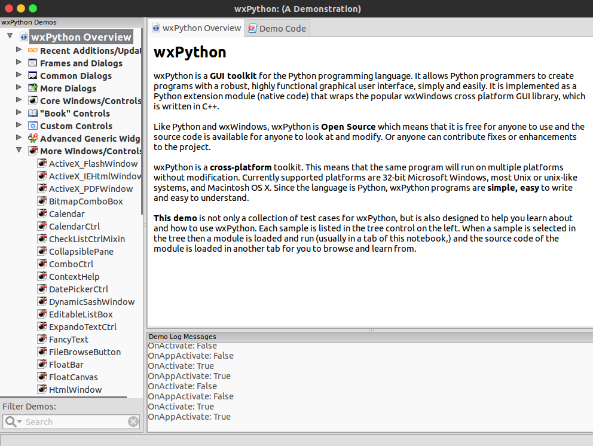
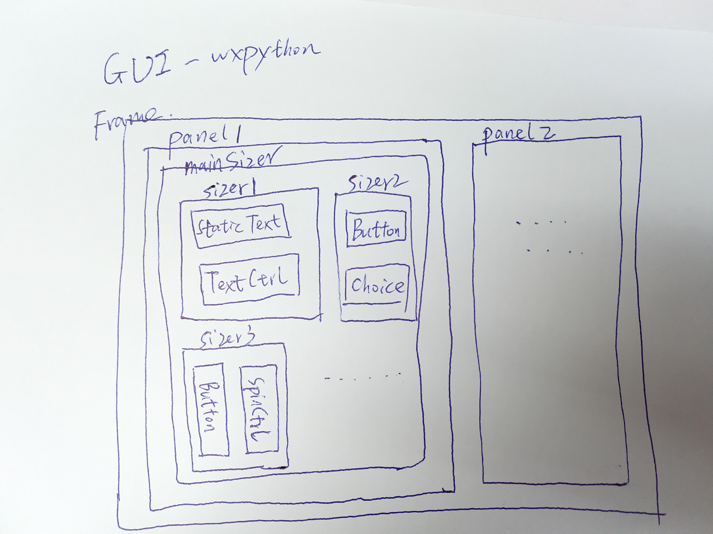

## WxPython-GUI库学习

## WxPython安装（Ubuntu）

```
sudo apt-get install python-wxgtk3.0
# or
sudo pip install wxPython
```

## 快速上手工具

#### 资料

> [比较系统全面的理解WxPython的组件和用法](https://www.cnblogs.com/franknihao/p/6567871.html)
>
> [官方Docs-2.8版本](http://xoomer.virgilio.it/infinity77/wxPython/APIMain.html)
>
> [教程](https://www.yiibai.com/wxpython/)

#### WxFormBuilder

wxFormBuilder是一个开源，跨平台的所见即所得的图形用户界面生成器，可以翻译wxWidget GUI设计成C++，Python和PHP或XML格式。

安装：

1. 去[官网](https://sourceforge.net/projects/wxformbuilder/)下载WxFormBuilder安装包

2. 解压并进入下载好的安装包，根据 ReadMe文档中的说明安装，以 **INSTALL FROM REPOSITORIES** 为例：

   - Add PPA for wxWidgets v3.0

     ```
     sudo add-apt-repository -y ppa:wxformbuilder/wxwidgets
     sudo apt-get update
     ```

   - Pre-requisites

     ```
     sudo apt-get install libwxgtk3.0-0 libwxgtk-media3.0-0
     ```

   - Add PPA for wxFormBuilder

     ```
     sudo add-apt-repository -y ppa:wxformbuilder/release
     sudo apt-get update
     ```

   - Install wxFormBuilder

     ```
     sudo apt-get install wxformbuilder
     ```

#### WxPython GUI Libary

wxpython demos and docs




## 教程

### 1. 布局

这里简单讲解一种容易理解并上手的WxPython的GUI布局：

WxPython被包装进了wx模块中，使用时 `import wx`即可；

- 首先，必须要做的是先建立一个应用的对象：

  ```python
  app = wx.App()
  #与这个app相关的一些控件、框架等的操作,一定要在MainLoop调用前处理完
  app.MainLoop()
  ```

- 创建一个顶层窗口的 wx.Frame 类的对象。

  Frame可以看做是wxPython提供的控件绘制的窗口，我们可以将控件绘制在Frame上，便于管理。默认情况下，Frame窗口自带最小化、最大化和关闭三个键。

  一般而言，我们不会直接调用Frame类，常见的是把需要的控件，事件处理方法等等封装进一个自己定义的Frame类的子类。那么这样一个子类其实抽象的就是一个个性化的窗口，比如：

  ```python
  class MyFrame(Frame):

      def __init__(self):
          Frame.__init__(self,None,-1,title="test",pos=(100,100),size=(200,200))
          '''
          布局上的一些个性化添加和操作
          '''    
      
      def someEventHandler(self,event):
          '''
          定义一些事件处理函数用于给控件Bind
          '''
          pass

  if __name__ == "__main__":
      app = App()    #创建应用的对象
      myframe = MyFrame()    #创建一个自定义出来的窗口
      myframe.Show()    #通过show()方法激活框架窗口
      #这两句一定要在MainLoop开始之前就执行    
      app.MainLoop()
  ```

- 虽然控件可以在Frame对象加入，但它们的布局无法管理。因此，需要把一个Panel对象添加到Frame框架。我们可以运用Panel来盛放其他控件，以实现对控件的分组管理：Panel可以看做是一个碎片化的Frame，当有一部分的控件需要同时处理，比如同时隐藏，同时显示的时候，可以将这些控件写入同一个Panel，这样方便于整体的操作。

- 虽然控件可以手动放置在面板指定屏幕坐标的位置，但是为了更好地控制布局和调整大小，建议使用 `Sizer` 来布局控件，它可以灵活地管理控件之间的相对位置。Sizer种类：

  - **wx.BoxSizer**：允许控件排放在按行或列的方式。BoxSizer布局是由它的定位参数(wxVERTICAL或wxHORIZONTAL)确定。
  - **wx.StaticBoxSizer**
  - **wx.GridSizer**：一个GridSizer对象呈现二维网格。控件被添加在网格槽以左到右和由上到下方顺序。
  - **wx.FlexGridSizer**：也有一个二维网格。然而，它提供多一点灵活性布局控件在单元中。 尽管同一行中的所有控件具有相同的高度，并且在同一列中的所有控件具有相同的宽度，但每个小区的大小是不均匀的。
  - **wx.GridBagSizer**：它比FlexiGridSizer提供了更多的增强功能。子构件可被添加到网格中的特定单元。此外，一个子物件可以在水平和/或垂直地占据一个以上的单元。 因此，在同一行中的静态文本和多行文本控件可以有不同的宽度和高度。

- 之后就可以在Sizer中加入需要的控件，设定他们的size和内容，以及绑定时间等。

- 最后，Sizer有个Fit(window)的方法，调用之后可以让窗口根据sizer调整窗口大小，使窗口刚好能够放下sizer中的所有组件。

  整体GUI构建架构示意图如下所示：

  

  代码示例：

  ```python
  import wx
  class FetchFrame(wx.Frame):
      def __init__(self):
          self.CreateWidgets()
          self.BtnHandle()
          
      def CreateWidgets(self):
          wx.Frame.__init__(self, parent=None, id=wx.ID_ANY, title="AOI-DataBase FetchGUI")
          self.panel = wx.Panel(self)

          self.main_sizer = wx.BoxSizer(wx.VERTICAL) #auto layout

          self.button_sizer = wx.BoxSizer(wx.HORIZONTAL)
          self.hint_sizer = wx.BoxSizer(wx.HORIZONTAL)

          # detailed definition about button Sizer:           
          self._buttonSizer()
          # detailed definition about hint Sizer:      
          hint_msg = '注意！！！按下保存按钮后请不要退出GUI，保存结束程序会提示您!!!'
          self.static_text_hint = wx.StaticText(self.panel, -1, hint_msg)
          self.hint_sizer.Add(self.static_text_hint, proportion=0, flag=wx.ALL, border=5)
          # main
          self.main_sizer.Add(self.button_sizer, proportion=0, flag=wx.ALL, border=5)
          self.main_sizer.Add(self.hint_sizer, proportion=0, flag=wx.ALL, border=5)

          self.panel.SetSizer(self.main_sizer)
          self.main_sizer.Fit(self)
          self.panel.Layout()
          
      def _buttonSizer(self):
          self.save_btn = wx.Button(self.panel, label="保存")
          self.quit_btn = wx.Button(self.panel, label="退出")
          self.button_sizer.Add(self.save_btn, proportion=0, flag=wx.ALL, border=5)
          self.button_sizer.Add(self.quit_btn, proportion=0, flag=wx.ALL, border=5)
          
      def BtnHandle(self):
          # button
          self.save_btn.Bind(wx.EVT_BUTTON, self.OnSaveData)
          self.quit_btn.Bind(wx.EVT_BUTTON, self.OnQuit)
      def OnSaveData(self, event):
        	pass
      def OnQuit(self, event):
        	pass
  if __name__ == "__main__":
      app = wx.App()
      frame = FetchFrame()
      app.SetTopWindow(frame)
      frame.Show()
      app.MainLoop()
  ```

  ​

### 2. 控件学习

#### 日期时间

- wx.DatePickerCtrl 日期

- wx.CalenderCtrl 日期
- wx.Time 时间


关于时间，我暂时使用的是三个 `wx.SpinCtrl` 控件，分别代表 时，分，秒；

### 3. 坑 

#### ① 控件获得的Value的编码

- TextCtrl，RadioBox所获得的用户输入的值的编码为`Unicode`；所以经常有：

  ```python
  self.unit_name = self.text_ctrl_unit_name.GetValue().encode("utf-8")
  self.unit_type = self.unit_type_radio_box.GetStringSelection().encode("utf-8")
  ```

  可将Unicode转换为String；

#### ② Choice控件获得的Value

GetCurrentSelection()得到的是给定的ChoiceList中的一个下标：

```python
self.cu_type = CU_TYPE_CHOICE[self.cu_type_choice.GetCurrentSelection()]
```


### 4. 技巧

#### ①不同模式不同控件

根据需求，有时候同一个GUI可能有不同的模式，比如， 使用者模式，开发者模式等；不同的模式下，有不同的控件和需求，下面简单讲解，如何设计不同模式的GUI：

1. 首先，在GUI中放入一个模式控件，可以是 `wx.Choice` 控件，也可以是  `wx.RadioBox`控件等，只要是一个可选择的控件即可。eg：

   ```python
   MODE_CHOICE = ['AI模式', '非AI模式'] 

   def CreateWidgets(self):
   	wx.Frame.__init__(self, parent=None, id=wx.ID_ANY, title="AOI-DataBase FetchGUI", pos=wx.DefaultPosition, \
                       size=wx.DefaultSize, style= wx.DEFAULT_FRAME_STYLE, name="FetchDataGUI")
   	self.panel = wx.Panel(self)
   	self.main_sizer = wx.BoxSizer(wx.VERTICAL) #auto layout
       self._modeSizer()
       self.main_sizer.Add(self.mode_sizer, proportion=0, flag=wx.ALL, border=5)
       self.panel.SetSizer(self.main_sizer)
       self.main_sizer.Fit(self)
       self.panel.Layout()
       
   def _modeSizer(self):
       self.mode_radio_box = wx.RadioBox(self.panel, -1, '模式选择：', pos=wx.DefaultPosition, size=wx.DefaultSize,
                                             choices=MODE_CHOICE,
                                             majorDimension=len(MODE_CHOICE), style=wx.RA_SPECIFY_COLS)
       self.mode_sizer.Add(self.mode_radio_box, proportion=0, flag=wx.ALL, border=5)
   ```

2.  定义，当模式被选择后，模式所对应的控件布局

   控件有 `Show()`， `Enable()`， `Disable()`等函数，分别代表：是否显示在布局上，使控件可使用，使控件不能被选中等。

   因此可以运用上面三个函数，在某个模式下，对某个控件给予`Show(True)`， `Show(False)`，  `Enable()`， `Disable()` 等属性，即可使控件在某种模式下被显示，隐藏，可使用，不可使用；

   设置之后，注意要重新布局：`self.panel.Layout()`

   ```python
       def onModelChoice(self, event):
           self.mode = self.mode_radio_box.GetStringSelection().encode("utf-8")
           if self.mode == MODE_CHOICE[0]:
               self._show(T=False, F=True)
           elif self.mode == MODE_CHOICE[1]:
               self._show()
   		# 重新布局
           self.main_sizer.Fit(self)
           self.panel.Layout()

       def _show(self, T=True, F=False):
           self.state_radio_box.Show(T)
           self.unit_type_radio_box.Show(T)
           self.static_text_unit_name.Show(T)
           self.text_ctrl_unit_name.Show(T)
           self.save_btn.Show(T)
           self.fetch_btn.Show(T)
           self.cu_type_radio_box.Show(F)
           self.ai_save_btn.Show(F)
   ```

   ​

3.  以上两步，GUI中不同模式的布局已经完成，剩下的仅需要，对不同模式下的控件，设置不同的响应函数。


#### ②动态改变下拉框内容

应用场景:

当用户选择了某种条件，某种模式，或者某种选项，另一种可选择的下拉框内容将会改变。

```python
  	self.cu_type_choice = wx.Choice(self.panel, -1, size=(150, -1), choices=CU_TYPE_CHOICE)
  self.manul_label_choice = wx.Choice(self.panel, -1, size=(150, -1), choices=MANUL_LABEL_CHOICE)
  self.cu_type_choice.Bind(wx.EVT_CHOICE, self.onCuTypeChoice)
  
  	def onCuTypeChoice(self, evnet):
        self.cu_type = CU_TYPE_CHOICE[self.cu_type_choice.GetCurrentSelection()]
        print self.cu_type
        if 'SMD' in self.cu_type:#smd
            self.manul_label_choice.SetItems(SMD_LABEL_CHOICE)
        elif 'Leaded' in self.cu_type:
            self.manul_label_choice.SetItems(LEADED_LABEL_CHOICE)
        else:
            self.manul_label_choice.SetItems(MANUL_LABEL_CHOICE)
```

`cu_type_choice` 下拉框选择绑定 了函数 `onCuTypeChoice()`，函数中通过判断`cu_type_choice`中用户选择的内容，通过`SetItems`，赋予另一个下拉框 `manul_label_choice`，不同的下拉框选项。