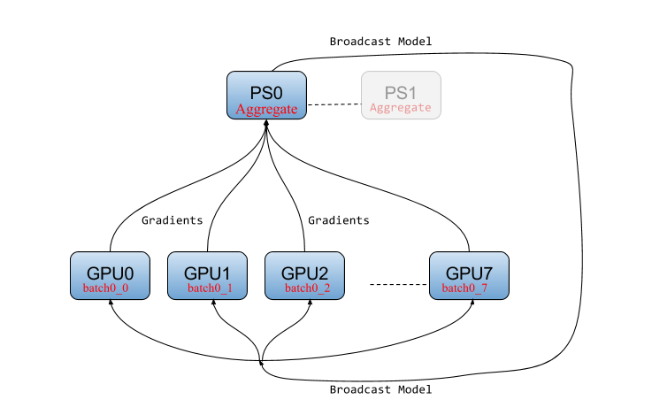
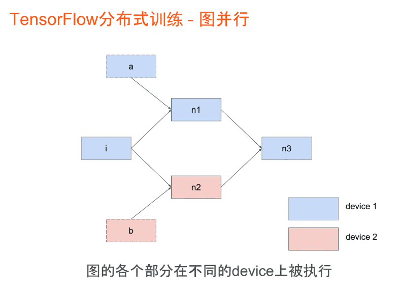
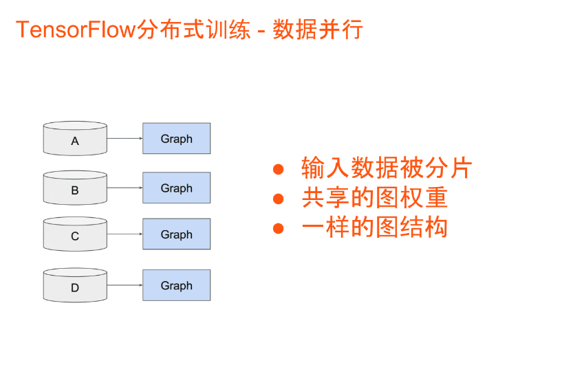
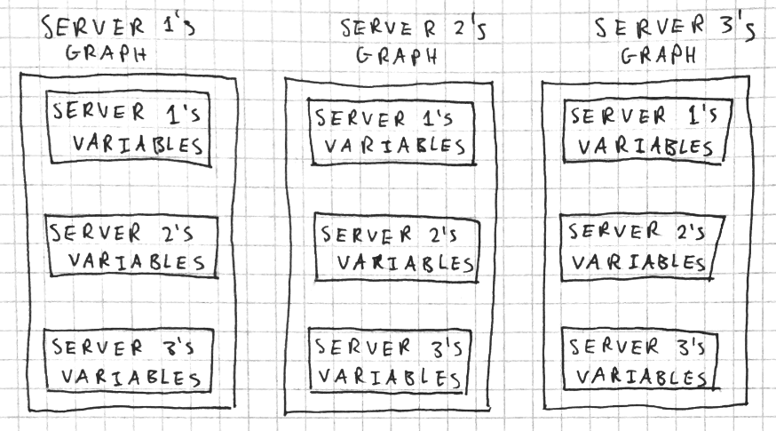
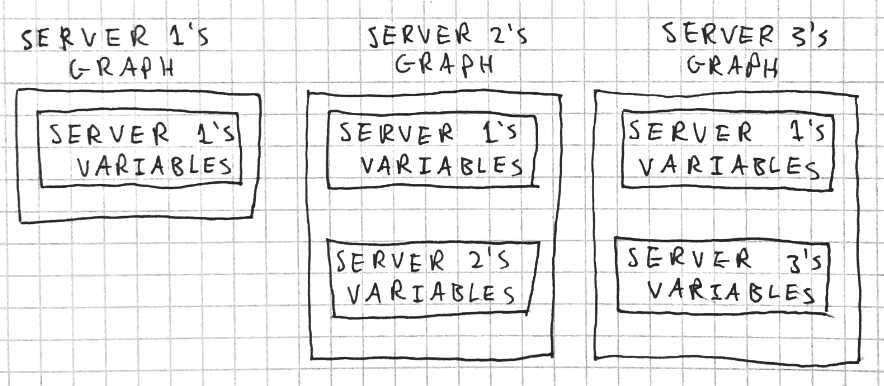
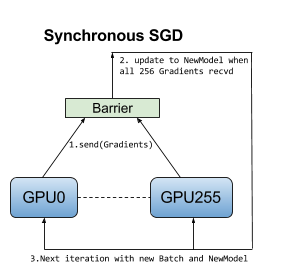
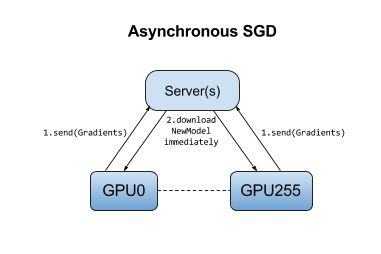

# Distributed Tensorflow

## 详解

> 参考： [官网docs](https://www.tensorflow.org/deploy/distributed)

TensorFlow的两种不同的分布式方法：

1. 在许多GPU（和服务器）上运行并行实验来搜索好的超参数
2. 通过多个GPU（和服务器）分布式训练单个网络，减少训练时间

### PS-Worker架构

tensorflow将模型维护和训练计算解耦合，将模型训练分为两个job：

- 模型相关：模型参数存储、分发、汇总、更新，由PS执行
- 训练相关：包含推理计算、梯度计算（正向/反向传播），由worker执行

该架构下，所有的woker共享PS上的参数，并按照相同的数据流图传播不同batch的数据，计算出不同的梯度，交由PS汇总、更新新的模型参数，大体逻辑如下：

1. pull：各个woker根据数据流图拓扑结构从PS获取最新的模型参数
2. feed：各个worker根据定义的规则填充各自batch的数据
3. compute：各个worker使用第一步的模型参数计算各自的batch数据，求出各自batch的梯度
4. push：各个worker将各自的梯度推送到PS
5. update：PS汇总来自n个worker的n份梯度，来更新模型参数

分布式经典架构PS-worker会重复上面步骤，直到损失到达阈值或者轮数到达阈值。

体系架构如图所示：



### 模型并行与数据并行

**何谓模型并行？**

> 切分模型，模型不同层执行在不同设备上，一个批次样本可以在不同设备同时执行。TensorFlow尽量让相邻计算在同一台设备上完成节省网络开销。



**何谓数据并行？**

> 切分数据，每个设备上都有相同的模型，但是每个设备都使用不同的训练样本进行模型训练。



我们接下来重点关注 **数据并行** 。

### 图内复制和图间复制

图内复制和图间复制是数据并行模式按照数据流图构建模式分类而成；

**何谓图内复制？**

> In this approach, the client builds a single [`tf.Graph`](https://www.tensorflow.org/api_docs/python/tf/Graph) that contains one set of parameters (in [`tf.Variable`](https://www.tensorflow.org/api_docs/python/tf/Variable) nodes pinned to `/job:ps`); and multiple copies of the compute-intensive part of the model, each pinned to a different task in `/job:worker`.

简而言之，每个设备都有ps的一份共享参数，和其他所有Worker的参数的copies：



使用图内复制时，所有op都在同一个图中，用一个client来生成图，把所有操作分配到集群所有ps和Worker上。图内复制和单机多卡类似，扩展到多机多卡，数据分发还是在客户端一个节点上。

所以此方式配置起来非常简单，只需要一个client生成，其他Worker只需要join，暴露一个网络接口，等在那里接受任务就好。但是，缺点就是训练数据的分发在一个Worker上，要把训练数据分到不同的机器上，严重影响了并发的训练速度。

总结：

`优势`，计算节点只需要调用join()函数等待任务，客户端随时提交数据就可以训练。

`劣势`，训练数据分发在一个Worker上，要分发给不同Worker，严重影响并发训练速度。

**何谓图间复制？**

> In this approach, there is a separate client for each `/job:worker` task, typically in the same process as the worker task. Each client builds a similar graph containing the parameters (pinned to `/job:ps`as before using [`tf.train.replica_device_setter`](https://www.tensorflow.org/api_docs/python/tf/train/replica_device_setter) to map them deterministically to the same tasks); and a single copy of the compute-intensive part of the model, pinned to the local task in `/job:worker`.

简而言之，每个设备都有一份ps的共享参数，和自己的参数：



使用图间复制时，每一个Worker创建一个图，训练参数保存在ps，数据不分发，各个工作节点独立计算，计算完成把要更新的参数发给ps，ps更新参数即可。

所以，图间复制时，训练的参数保存在ps，数据不用分发，数据分片的保存在各个Worker，各个Worker自己算自己的，算完后把要更新的参数告诉ps，ps更新参数。这种模式的优点是不用进行训练数据的分发，尤其数据量在TB级的时候，节省了大量的时间，所以大数据深度学习推荐使用图间复制模式。

`优势` ：不需要数据分发，各个工作节点都创建图和读取数据训练。

`劣势` ：Worker既是图创建者又是计算任务执行者，某个工作节点宕机影响集群工作。大数据相关深度学习推荐使用图间模式。

### 同步更新和异步更新

同步更新和异步更新是数据并行模式按照参数更新机制分类而成；

**何谓同步更新？**

> 所有worker完成本轮计算后，汇总梯度，更新模型，计算能力强的worker需要阻塞等待其他worker

synchronous training with stochastic gradient descent (SGD):



**同步更新，只有在所有设备都成功计算并向PS发送了梯度后，模型才会更新。**

因此，这意味着，如果存在一个拖后腿的设备（计算速度慢或者网络连接速度慢），训练过程会严重停滞。

`优势`  ：每个训练批次考虑所有Worker训练情况，损失下降稳定， 收敛快。

`劣势`  ：性能瓶颈在最慢的Worker。Worker之间性能不同，劣势明显。

**何谓异步更新？**

> 各个worker独立训练，计算出梯度后即刻更新参数，不需要等待其他worker完成计算

Asynchronous training with stochastic gradient descent (SGD):



**异步更新，任何设备都不会等待来自任何其他设备的模型更新；计算出梯度后立即更新。**

`优势` ：性能不存在瓶颈。

`劣势` ：每个Worker计算梯度值发回PS有参数更新冲突，影响算法收敛速度，损失下降过程抖动较大，不稳定。

**总结：**

> 同步更新、异步更新实现区别于更新参数服务器参数策略。
>
> 数据量小，各节点计算能力较均衡，用同步模型。
>
> 数据量大，各机器计算性能参差不齐，用异步模式。

### 角色分配

Tensorflow分布式是有一个`Cluster`组成， 它包含一个或者多个PS，以及多个Worker；

- ps：作为分布式训练的参数服务器，等待各个Worker来连接，聚合梯度，把更新后的weights（model）发送出去；

- worker：得到任务并进行计算；

- chief supervisors：在所有Worker中选择一个作为`主Worker`， 负责协调模型训练，模型初始化，已完成训练步骤的统计，会话监控，TensorBoard的日志保存，为从故障中恢复进行模型断点的保存和恢复。主 worker也会管理故障，在一个worker或者参数服务器失效的情况下确保容错能力。如果主worker自己宕机，那么需要从最近的模型断点开始恢复训练过程。

  **注意：** Tensorflow分布式必须显式的管理各个设备的启停。这意味着，要跟踪程序中所有TensorFlow服务器的IP地址和端口，并且手动启停这些服务器。

### 训练步骤

#### 1. 创建一个Cluster 

`Cluster` 就是一组job，tensorflow一般将job分为两类：

- ps：用于存储参数；
- Worker：用于执行具体的计算。

第一步，我们就要创建一个Cluster，用 `tf.train.ClusterSpec`来描述Cluster中所有的job，并且用`tf.train.Server`指定本机的任务和job类型。代码如下：

```python
# 参数服务器parameter server节点
flags.DEFINE_string('ps_hosts', '192.168.16.115:22221', 'Comma-separated list of hostname:port pairs')
# 两个worker节点
flags.DEFINE_string('worker_hosts', '192.168.16.115:22222,192.168.16.115:22223',
                    'Comma-separated list of hostname:port pairs')
# 设置job name参数
flags.DEFINE_string('job_name', None, 'job name: worker or ps')
# 设置任务的索引
flags.DEFINE_integer('task_index', None, 'Index of task within the job')
FLAGS = flags.FLAGS
def main(unused_argv):
    ps_spec = FLAGS.ps_hosts.split(',')
    worker_spec = FLAGS.worker_hosts.split(',')

    # 创建集群
    num_worker = len(worker_spec)
    cluster = tf.train.ClusterSpec({'ps': ps_spec, 'worker': worker_spec})
    server = tf.train.Server(cluster, job_name=FLAGS.job_name, task_index=FLAGS.task_index)
    
if __name__ == '__main__':
    tf.app.run()
```

然后用这同一份代码在不同的机器上运行：

```bash
python worker.py --job_name=ps --task_index=0
python worker.py --job_name=worker --task_index=0
python worker.py --job_name=worker --task_index=1
```

#### 2. 定义PS操作

tensorflow中的参数服务器只需要管理tensorflow中的变量，不需要执行训练的过程，所以如果当前机器的Job是PS，那么就只需要调用`server.join()`即可。

```python
if FLAGS.job_name == 'ps':
  	server.join()
```

#### 3. 定义Chief Worker

在所有的Worker中，有且只有一个是Chief Worker，它除了负责计算外，还负责输出日志，保存模型等；这里设置task index为0的机器为chief worker：

```python
is_chief = (FLAGS.task_index == 0)
```

#### 4. 图间复制分配参数和计算

tensorflow中的`tf.train.replica_device_setter` 函数会自动将所有的参数分配到ps上，而将计算分配到当前的Worker上。如果有多个ps，就轮流循环分配：

```python
with tf.device(tf.train.replica_device_setter(
            cluster=cluster
    )):
```

#### 5. 定义model

与单机一样：

```python
loss = ...
train_op = ...
init_op = ...
saver = ...
summary_op = ...
...
```

#### 6.  
